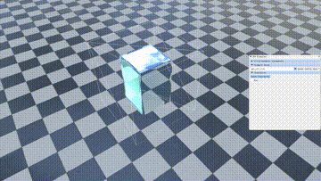
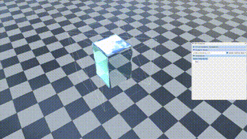

# SPH_CUDA

[](https://github.com/RaymondMcGuire/SPH_CUDA/actions/workflows/WindowsCUDA.yml)

Screen Space Fluid + SPH/WCSPH(CUDA version).

## Environment

- C++ & CUDA10.2
- Install [CUDA](https://developer.nvidia.com/cuda-downloads) and [Cmake](https://cmake.org/download/) first

## Setup

### Command Line

```rb
cd /to/your/project/path
```

```rb
mkdir build
```

```rb
cd build
```

```rb
cmake .. -G"Visual Studio 16 2019" -A x64
```

### Scripts

#### For Windows

- cd to ./scripts folder
- choose your visual studio version(vs15/vs17/vs19)
- run the bat file

## Gallery
- SPH 
-  
- WCSPH
- 

## Papers implemented

 * Müller, Matthias, David Charypar, and Markus H. Gross. "Particle-based fluid simulation for interactive applications." Symposium on Computer animation. 2003.
 * Becker, Markus, and Matthias Teschner. "Weakly compressible SPH for free surface flows." Proceedings of the 2007 ACM SIGGRAPH/Eurographics symposium on Computer animation. 2007.
 * Akinci, Nadir, et al. "Versatile rigid-fluid coupling for incompressible SPH." ACM Transactions on Graphics (TOG) 31.4 (2012): 1-8.
